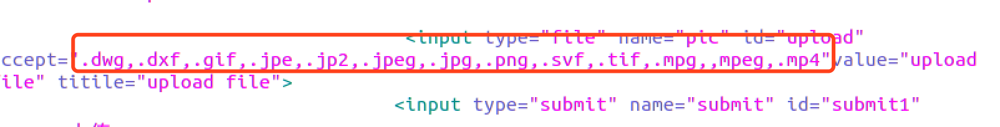
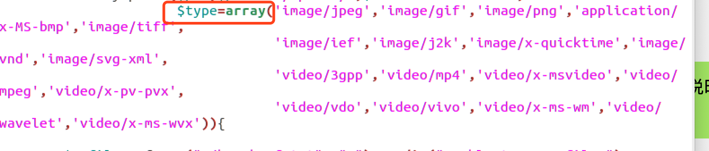
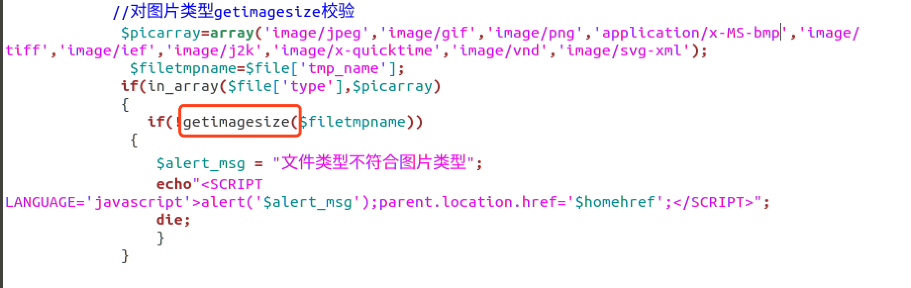

### 一、漏洞描述
- webshell文件上传漏洞出现在具有图片上传功能的idol个人福利社主页。

- 服务器完成文件上传功能进行了前端后缀名检测

  

  与后端Content-type类型检测
  
- 为上传一句话木马php脚本到服务器，形成后门，将上传的一句话木马php脚本后缀名从`.php`添加新后缀`.jpeg`，绕过前端后缀名检测的同时，也使得其Content-type变成`image/jpeg`，利用burpsuite在进行文件上传时进行截取，删除后缀名`.jpeg`，成功上传文件到服务器，并利用`中国蚁剑`与上传成功的php后门连接得到webshell

  [漏洞演示](https://pan.baidu.com/s/1nZOttPKHxoqbzaaOJQ7XFw )       提取密码:awir

### 二、漏洞修复

- 利用校验函数getimagesize()，对图片类型的文件在后端服务器进行校验，避免通过burpsuite截取流量后修改后缀名或者Content-type绕过限制，上传木马。(当下这种解决方法只是解决上述漏洞，同样可以通过在图片中嵌入木马实现绕过达到攻击效果。)

  

### 三、参考文献

- [木马文件上传防御策略及几种绕过检测方式](https://zhuanlan.zhihu.com/p/25889423)

- [文件上传漏洞](https://zhuanlan.zhihu.com/p/25220150)