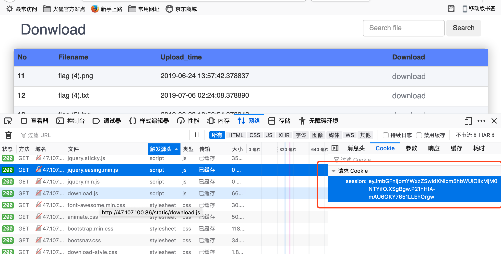

# break it————文件下载
### 攻击分析漏洞结果
- python web flask session结合python代码中格式化字符串漏洞

### 攻击分析过程
- firefox浏览器打开`http://47.107.100.86/`，进行正常的注册，随机输入用户名与密码，多次进行尝试未有其他如用户名或者密码长度不够、强度不够等的提示，均显示`Sign up failed`。经过多次尝试，发现设置用户名与密码长度大于6时才能进行正常注册，注册成功后跳转到登录界面进行登录。
- 登录成功后成功进入文件下载页面，仔细浏览可被下载的文件，发现以flag(x)(1≤x≤4，6≤x≤8)命名时均有对应的jpg格式图片，png格式图片，txt格式文本文件，只有flag(5)仅存在jpg与png格式的图片，不存在txt格式的文本，此时产生最终的flag会在flag(5).txt的怀疑。


- 由于web提供可下载的文件并不多，尝试全部下载逐一分析一些flag(*)的png/jpg图片与txt文本进行观察分析，在flag(1).txt中获得以下`Life is short, I choose python.`，flag(2).txt得到`pyhton  is good`,flag(8).png图片中得到`You program python?That explains why you are so smart,andsome and sexy`


多处pyhton提示猜测该web服务器开发语言为python。

- `F12`打开开发者工具，进行下载等操作，分析页面源码与Network流量，cookie中居然固定只有session值，结合flag(3).txt得到` I could tell you a joke about UDP but I don't know if you would get it. It's better than my TCP joke - I have to keep telling it over and over again.`。结合资料查询，到此基本确定该web存在「flask 的传输session时仅签名的安全问题」。
  


- 注册多个用户并登录下载，尝试编写python代码从cookie中获得的session值得到更多有用信息。
```bash
#sessionget.py
from itsdangerous import *
s1 = "eyJmbGFnIjpmYWxzZSwidXNlcm5hbWUiOiIxMjM0NTY3In0.XSgLFA.1iy0TpkI3m0PBQ9TUtRJIV7VK38"
s = "eyJmbGFnIjpmYWxzZSwidXNlcm5hbWUiOiIxMjM0NTYifQ.XSgBgw.P21hHfA-mAU6OKY7651LLEhOrgw"
data,timestamp,secret = s.split('.')
data1,timestamp1,secret1 = s1.split('.')
# base64_decode(data)
print("data")
print(base64_decode(data),'\n')
print(base64_decode(data1),'\n')
print("timstamp")
timestamp=int.from_bytes(base64_decode(timestamp),byteorder='big')
print(time.strftime('%Y-%m-%d %H:%I%S', time.localtime(timestamp+EPOCH)))
timestamp1=int.from_bytes(base64_decode(timestamp1),byteorder='big')
print(time.strftime('%Y-%m-%d %H:%I%S', time.localtime(timestamp1+EPOCH)))
> data
b'{"flag":false,"username":"123456"}' 
b'{"flag":false,"username":"1234567"}' 
timstamp
2060-07-11 11:1155
2060-07-11 12:1244
```
一般用户的传递给服务器的session信息里携带的经过base64编码的flag应该均为false。

- 重点分析`flag(5).png与flag(5).jpg`结合图片内容分析获得`CODE SO HARD .MOTHERFUCKERS WANNA FIND ME`


- 到此形成初步攻击思路： 通过其他漏洞获得secret_key，伪造session以管理员身份登录以下载flag(5).txt获得最终flag。

- 该web存在可与后台服务器进行数据交互具有搜索目标文件功能的输入框，并且对于搜索结果会返回一定的信息，具有固定的返回信息页面URL地址特点`http://47.107.100.86/lists?filename=`，如下：


  - 通过`; and 1=1 and 1=2`判断无sql注入点

  

- 结合查询资料，python flask为获得session传输过程中的scret_key并不多可利用漏洞为python格式化字符串问题。

### 参考
- [Python 格式化字符串漏洞（Django为例）](https://www.leavesongs.com/PENETRATION/python-string-format-vulnerability.html)
- [Python Web之flask session&格式化字符串漏洞](https://xz.aliyun.com/t/3569)
- [从两道CTF实例看python格式化字符串漏洞 ](https://www.anquanke.com/post/id/170620#h2-13)